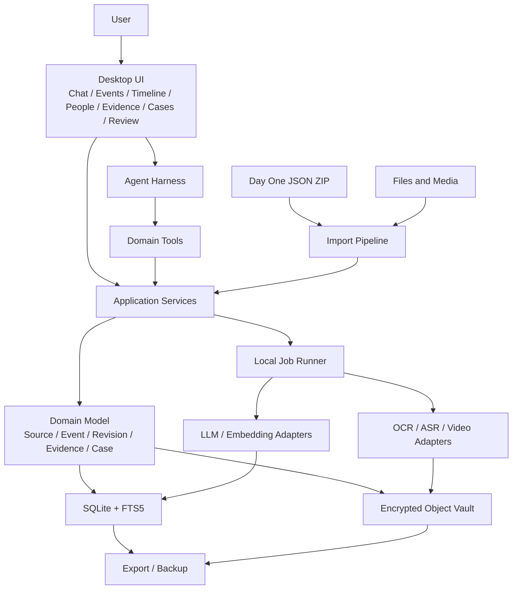
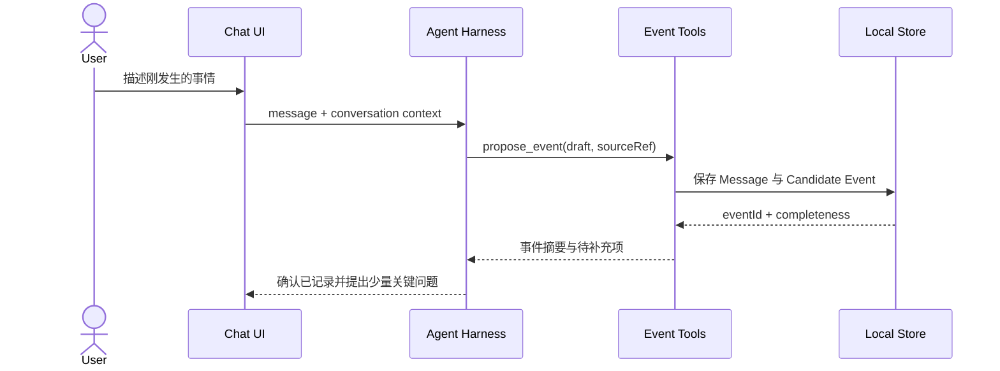

# Grudge Vault 架构设计与实现

> 状态：初始设计稿
>
> 目标：为可以直接进入开发的 Local-first 桌面产品提供架构基线，同时保留面向模型、索引、客户端和数据源的演进空间。

## 1. 架构目标

Grudge Vault 要解决的不是普通日记存储，而是把聊天、日记和多媒体沉淀成长期可用的事件记忆。架构需要同时支持：

- 极低成本地记录当下事件；
- 从 Day One 等历史来源回填事件；
- 保留原始内容，并让所有派生内容可以追溯；
- 表达模糊信息、用户回忆和后续修订；
- 从单个事件逐步生成人物、时间线、模式、Case 和策略上下文；
- 在断网时完成基础记录、浏览、编辑和检索；
- 让 Agent 通过受控工具工作，而不是直接操作数据库和文件。

设计优先保证“可用闭环”和“数据可信”，并通过适配器保留替换空间。早期不需要为了未来规模预先部署分布式数据库、独立搜索集群或微服务。

## 2. 架构原则

### 2.1 Local-first，而不是 Local-only

数据、索引和材料默认保存在本地。没有模型服务时，记录、编辑、附件导入、全文搜索和导出仍然可用。

模型执行分为两个可配置模式：

- **Private**：本地模型、本地 Embedding、本地 OCR、本地 ASR，内容不离开设备。
- **Enhanced**：用户明确启用后，通过脱敏和最小上下文调用外部模型。

两种模式共享领域模型和工具层，不为不同模型维护两套产品逻辑。

### 2.2 Chat 是入口，Event 是核心

Conversation 用来保存交互过程，Event 才是检索、回顾和分析的长期实体。Agent 可以从一段对话创建一个或多个候选事件，也可以只记录为普通 Source Item。

### 2.3 原件、派生物、分析分层

```text
Original Object
    ↓ 可重复处理
Derived Artifact（OCR / Transcript / Key Frames）
    ↓ 可重新分析
Analysis Result（事件提取 / 关联 / 风险 / 策略）
```

原始材料一经写入保险库便不由 AI 修改。重新转写或更换模型会生成新的派生版本，不覆盖原件和旧结果。

### 2.4 不确定性是一等数据

未知、约数、范围和来源都必须可表达。系统不把“约 9 月”转换为某个虚构的精确日期，也不把模型推断写成已确认事实。

### 2.5 追加修订，维护当前投影

用户编辑事件时新增 revision，并同步更新便于查询的当前投影。这样既能获得普通应用的编辑体验，也能回答“这条信息何时、依据什么发生了变化”。

### 2.6 能力通过工具组合

Agent Runtime 只能调用显式工具读取或修改本地数据。工具负责校验、事务、权限和审计，模型负责理解意图、选择工具和组织结果。

## 3. 系统全景



### 3.1 逻辑分层

| 层 | 职责 | 不承担的职责 |
| --- | --- | --- |
| Presentation | 对话、表单、时间线、待补全箱、导入进度和审阅交互 | 直接读写 SQLite 或原始文件 |
| Agent Harness | 意图理解、上下文组装、工具编排、回答生成 | 绕过工具修改数据 |
| Application | 用例、事务、任务调度、导入流程、导出流程 | 绑定某一种 UI 或模型 |
| Domain | Event、Source、Evidence、Revision、Case 的规则与状态 | 文件解码、模型 API 细节 |
| Infrastructure | SQLite、对象保险库、密钥、搜索、模型、多媒体 Adapter | 产品决策 |

## 4. 首选实现基线

为了让首版可以快速形成完整闭环，建议使用一套 TypeScript 为主的桌面架构：

| 关注点 | 初始选择 | 说明 |
| --- | --- | --- |
| Desktop Shell | Electron | 文件、系统能力和本地进程生态成熟，适合本地 Agent 工具 |
| UI | React + TypeScript | 适合对话、列表、时间线和复杂编辑界面 |
| Main Runtime | Node.js + TypeScript | 承载应用服务、Agent Harness、导入器和任务调度 |
| Database | SQLite（WAL） | 单机事务、迁移和备份简单 |
| Text Search | SQLite FTS5 | 首版无需独立搜索服务 |
| Object Storage | 本地内容寻址目录 | 原件与派生物分层，便于去重与校验 |
| Background Work | SQLite-backed Job Runner | 任务可恢复、可观察，不需要独立消息队列 |
| Secrets | OS Keychain + Workspace Key | 避免把密钥明文写入配置文件 |
| AI / Media | Adapter 接口 | 本地或远程实现按用户配置组合 |

这是实现基线而非永久约束。如果后续需要 Tauri、原生客户端、独立本地服务或新的模型运行时，只要保持 Application API、Domain Model 和 Tool Contract 稳定，就可以渐进替换。

### 4.1 Electron 进程边界

- Renderer 只负责 UI，不开放 Node 集成。
- Preload 暴露小而明确的类型化 API。
- Main Process 执行数据库、文件、密钥、导入和 Agent 操作。
- OCR、ASR、视频解析和本地模型等重任务进入 Worker 或受控子进程，避免阻塞界面。

IPC 以业务命令而不是底层文件或 SQL 为单位，例如 `events.create`、`imports.start`、`clarifications.resolve`。这样将来更换客户端时，命令可以平移到本地 API。

## 5. 领域模型

### 5.1 核心实体

| 实体 | 关键职责 |
| --- | --- |
| Workspace | 隔离一个用户空间的配置、密钥和数据版本 |
| Source | 描述来源类型，如 chat、dayone、manual-file |
| SourceItem | 保存一条原始输入的元数据和可引用内容，如 JournalEntry 或 Message |
| Asset | 指向保险库中的原始二进制对象及其哈希、大小、MIME、来源 |
| DerivedArtifact | OCR、Transcript、关键帧、缩略图等可再生结果 |
| Event | 当前可用的事件投影，是搜索、回顾和分析的中心 |
| EventRevision | Event 的追加式修订记录 |
| EventSource | Event 与 SourceItem / Asset 的多对多出处关系 |
| Person | 统一人物身份，并允许别名和待确认合并 |
| EventRelation | 事件之间的相似、因果、前后、同一 Case 等关系 |
| Clarification | 一个待用户补充或确认的问题 |
| AnalysisRun | 记录模型、输入引用、输出、版本和生成时间 |
| Case | 围绕一组权益相关事件组织时间线和材料 |
| CaseItem | Case 中的事件、材料、问题、金额或人物条目 |

### 5.2 Event 建议结构

```ts
type Event = {
  id: string;
  title: string;
  status: "candidate" | "confirmed" | "archived";
  occurredAt: TemporalValue;
  recordedAt: string;
  location?: SourcedValue<string>;
  narrative?: string;
  facts: Statement[];
  interpretations: Statement[];
  emotions: Emotion[];
  interests: Interest[];
  participants: EventParticipant[];
  sourceRefs: string[];
  assetRefs: string[];
  completeness: CompletenessSummary;
  currentRevision: number;
};
```

`candidate` 表示由历史日记或模型提取、仍需确认的事件；`confirmed` 表示用户认可它应作为独立事件存在。确认不等于事件中的每个字段都已客观验证。

### 5.3 带来源的字段

关键字段采用统一的 `SourcedValue`，允许保存精度和依据：

```json
{
  "value": 5000,
  "precision": "approximate",
  "certainty": "recalled",
  "sourceRef": "message:msg_01",
  "verified": false
}
```

建议的 `certainty` 起始集合包括 `observed`、`documented`、`recalled`、`inferred` 和 `unknown`。集合可以随真实数据调整，不把它设计成所谓“真实性概率”。

时间使用可表达不完整信息的 `TemporalValue`：

```ts
type TemporalValue =
  | { kind: "instant"; value: string }
  | { kind: "date"; value: string }
  | { kind: "month"; value: string }
  | { kind: "range"; from?: string; to?: string }
  | { kind: "relative"; text: string; anchorRef?: string }
  | { kind: "unknown" };
```

### 5.4 Statement 分类

每条陈述至少带有以下类别之一：

- `fact.confirmed`：有明确来源、且被用户确认的事实陈述；
- `fact.disputed`：各方说法不一致的事实；
- `fact.unknown`：已知存在缺口；
- `interpretation.user`：用户判断；
- `interpretation.agent`：模型推断；
- `emotion`：用户感受。

分类是为了让信息更清楚，而不是要求用户每次手动标注。Agent 可以给出候选分类，用户在关键场景中确认或纠正。

### 5.5 完整性与待补全

完整性由“已知字段、未知字段和重要缺口”组成，不只给一个黑盒分数：

```ts
type Clarification = {
  id: string;
  eventId: string;
  fieldPath?: string;
  question: string;
  reason: string;
  priority: "normal" | "important" | "rights_related";
  status: "open" | "answered" | "dismissed";
  sourceRefs: string[];
};
```

首页可以按重要性展示待补全项。用户回答后，系统创建 EventRevision，并把回答消息作为来源引用。

## 6. 数据持久化

### 6.1 SQLite

SQLite 保存结构化元数据、当前事件投影、修订、关系、任务和全文索引。建议启用 WAL、外键和显式迁移。

概念表组：

```text
workspace / settings
sources / source_items / source_versions
assets / derived_artifacts
events / event_revisions / event_sources
people / person_aliases / event_people / event_relations
clarifications
analysis_runs
cases / case_items
conversations / messages
jobs / job_attempts
fts_events / fts_sources / embeddings
```

JSON 可用于存放变化频繁的分析结果和修订快照；常用筛选字段保留为普通列。不要在首版把所有字段都拆成细粒度 EAV，也不要把所有内容都塞进一个 JSON 大字段。

### 6.2 对象保险库

对象以内容哈希寻址：

```text
workspace/
├── vault/
│   ├── objects/sha256/15/f4/15f42...
│   ├── derived/sha256/a8/31/a8310...
│   └── manifests/
├── db/grudge-vault.sqlite3
├── indexes/
├── exports/
└── logs/
```

写入流程：

1. 将外部文件复制到工作区临时目录；
2. 流式计算 SHA-256、大小和 MIME；
3. 加密后原子移动到内容寻址路径；
4. 在同一应用用例中创建 Asset 元数据；
5. 派生任务只读取原件，输出到 `derived`；
6. 定期校验对象哈希，并将异常展示给用户。

“不可变”指应用不就地修改由某个哈希标识的对象。用户仍然拥有删除权；删除通过明确操作和引用检查执行，并留下可读的操作记录。

### 6.3 修订模型

一次 Event 更新包含：

- 更新前版本号；
- JSON Patch 或完整规范化快照；
- 操作者（user、importer、agent）；
- 原因与来源引用；
- 发生时间。

应用写入 revision 后，在同一事务中更新 `events` 当前投影。冲突时返回最新版本供调用方合并，不静默覆盖。

### 6.4 搜索

搜索分三步逐步增强：

1. SQLite 过滤：时间、人物、状态、标签、Case；
2. FTS5：标题、叙述、事实、日记正文和 Transcript；
3. 可选向量召回：寻找语义相近的事件和来源。

结果排序可以组合关键词分数、语义分数、时间、来源质量和人物匹配，但每个命中都必须返回具体的 Event / Source / Transcript 引用，便于用户核对。

## 7. 关键数据流

### 7.1 对话记录事件



默认先保存原始消息，再执行事件提取。模型失败不会导致用户输入丢失。

### 7.2 Day One 导入与历史回填

1. 用户选择 JSON ZIP；
2. Importer 在隔离的 staging 目录校验压缩包、路径和大小；
3. 解析条目与媒体，创建 Import Run；
4. 优先按 Day One Entry UUID 去重，UUID 缺失时使用稳定指纹辅助判断；
5. 新条目写入 SourceItem，已存在且修改时间变化的条目写入 SourceVersion；
6. 媒体进入对象保险库，并关联 SourceItem；
7. 后台逐批生成候选事件和待补全项；
8. 用户确认、合并、忽略或编辑候选事件。

导入器必须幂等：重复导入同一个 ZIP 不创建重复条目；重新导出后发生变化的条目产生新来源版本。

Day One 官方当前支持 JSON ZIP 导出，并可包含分类后的媒体，详见 [Exporting entries](https://dayoneapp.com/guides/tips-and-tutorials/exporting-entries/)。官方 CLI 当前不能导出既有数据，因此它不作为读取路径，详见 [Command Line Interface](https://dayoneapp.com/guides/day-one-for-mac/command-line-interface-cli/)。

### 7.3 多媒体处理

所有多媒体处理遵循同一任务协议：

```text
Asset
  → probe metadata
  → enqueue processor
  → write DerivedArtifact
  → index searchable text
  → propose links / events / clarifications
```

- 图片：元数据、OCR、可选视觉描述；
- 音频：保留原音频，生成带时间戳 Transcript；
- 视频：提取音轨和关键帧，再复用音频与图片流程；
- 文档：提取文本和页码映射，原文件不变。

每个派生物记录 processor、版本、配置、输入哈希和生成时间。升级模型时可以选择性重跑，不破坏旧结果。

### 7.4 Case Binder

Case 从已有 Event、Asset 和 SourceItem 建立引用，不复制或篡改原件。导出包可以包含：

```text
case-summary.pdf
01_timeline/
02_statements/
03_people/
04_evidence-index/
05_originals/
06_transcripts/
manifest.json
sha256sums.txt
```

`manifest.json` 记录导出时选择的项目、来源、哈希和生成版本。Case Binder 是整理结果，不自动宣称材料具备某种法律效力。

## 8. Agent Harness

### 8.1 组件

```text
Agent Runtime
├── Intent Router
├── Context Builder
├── Tool Registry
├── Policy and Consent
├── Model Adapter
├── Run Log
└── Response Composer
```

- **Intent Router** 判断是记录、检索、回顾、补全、分析还是 Case 操作。
- **Context Builder** 先用确定性过滤缩小范围，再按需加入全文或语义召回结果。
- **Tool Registry** 为模型提供小而稳定的工具契约。
- **Policy and Consent** 控制外部模型调用、批量修改和导出等动作。
- **Run Log** 保存使用过的工具、引用 ID、模型和输出版本，便于重现。

### 8.2 工具分组

```text
Record
  record_source() propose_event() update_event() add_asset()

Retrieve
  search_events() get_event() get_sources()
  get_person_history() find_related_events()

Review
  build_timeline() list_clarifications() summarize_period()

Evidence
  verify_asset_hash() get_evidence() build_case()
  generate_case_bundle()

Strategy
  analyze_event() compare_options() create_action_plan()
```

早期工具可以由 TypeScript 函数直接注册，随后再抽象成版本化 JSON Schema。写工具返回更新后的实体版本和来源引用，确保 Agent 回答可以指向具体数据。

### 8.3 分析输出契约

分析至少分为：

```text
已确认事实
争议或未知事实
相关材料
用户感受与主观解释
可能涉及的利益
历史相似事件
风险和未知项
可选行动及其收益/代价
建议先补充的信息
```

模型输出先进入 `AnalysisRun`，不直接改写 Event。需要沉淀的新事实、人物或关系以 proposal 形式交给领域工具和用户确认。

## 9. 后台任务

导入、哈希、OCR、ASR、Embedding 和回填分析都可能耗时。首版使用 SQLite 任务表即可：

```ts
type Job = {
  id: string;
  type: string;
  payload: unknown;
  state: "queued" | "running" | "succeeded" | "failed" | "cancelled";
  progress?: number;
  attempts: number;
  availableAt: string;
  leaseUntil?: string;
};
```

Worker 通过短租约领取任务；应用异常退出后，过期任务可以重试。任务处理器尽量幂等，并以输入哈希和 processor version 避免重复生成派生物。

UI 应展示导入批次、处理进度、失败原因和重试入口。部分媒体失败不阻塞已成功内容的使用。

## 10. 隐私与安全

### 10.1 默认策略

- Renderer 不获得任意文件系统和数据库访问权；
- 工作区主密钥由系统钥匙串保护；
- 原始对象使用认证加密，明文只在受控处理期间存在；
- 外部模型默认关闭，需要由用户对具体工作区启用；
- 发送给外部模型前显示数据类型与脱敏策略；
- 日志不记录日记正文、Transcript、模型密钥或原始文件内容。

SQLite 元数据加密可以根据威胁模型和分发环境选择合适实现；接口从首版预留，但不让某个加密库渗透领域层。

### 10.2 备份与恢复

工作区导出应包含数据库快照、保险库对象、manifest 和版本信息。恢复流程先校验 manifest 与哈希，再迁移数据库。用户可以选择导出加密包或由自己管理的明文互操作格式。

### 10.3 数据生命周期

用户可以删除来源、事件或整个工作区。对象删除先检查引用；没有引用的对象进入可清理状态。对材料的物理删除应明确展示影响，并避免依靠不透明的“AI 记忆删除”。

## 11. 模块与目录规划

初始 Monorepo 可以采用：

```text
grudge-vault/
├── apps/
│   └── desktop/
│       ├── main/
│       ├── preload/
│       └── renderer/
├── packages/
│   ├── domain/
│   ├── application/
│   ├── persistence-sqlite/
│   ├── object-vault/
│   ├── agent-harness/
│   ├── importer-dayone/
│   ├── media-pipeline/
│   └── shared/
├── migrations/
├── fixtures/
│   └── dayone/
├── docs/
└── scripts/
```

模块间依赖方向：

```text
desktop → application → domain
                    ↘ ports
infrastructure adapters → ports
agent-harness → application commands / queries
```

`domain` 不依赖 Electron、SQLite 或某个模型 SDK。Importer 通过 Application Service 写 Source 和 Event Proposal，不直接操作领域表。

## 12. API 与事件

本地命令使用版本化输入输出：

```ts
type CommandEnvelope<T> = {
  requestId: string;
  workspaceId: string;
  commandVersion: number;
  payload: T;
};
```

应用内部发布领域事件，例如：

- `SourceItemImported`
- `AssetStored`
- `EventProposed`
- `EventRevised`
- `ClarificationOpened`
- `DerivedArtifactCreated`
- `CaseBundleGenerated`

首版可在进程内同步发布，并由事务后任务表承接耗时副作用；以后若拆出本地服务，事件语义仍可复用。

## 13. 测试策略

### 13.1 领域测试

- 模糊时间和约数不会被错误精确化；
- candidate 确认、合并和忽略状态转换；
- revision 追加与当前投影一致；
- fact、interpretation、emotion 不被混写；
- Clarification 回答能正确引用来源。

### 13.2 导入与保险库测试

- 使用去隐私化的 Day One ZIP fixtures；
- 重复导入、增量修改、缺失媒体和损坏 ZIP；
- ZIP 路径穿越与异常大文件；
- 同内容不同文件名去重；
- 原始对象和派生物的哈希校验。

### 13.3 Agent 评测

建立一组固定情景，检查：

- 能否找到正确历史事件和来源；
- 是否将未知内容保留为未知；
- 是否给出可引用的事实与材料；
- 是否在写入前使用正确工具；
- 本地模型和增强模型是否满足同一输出契约。

### 13.4 端到端测试

覆盖“导入日记 → 产生候选事件 → 用户补全 → 检索回顾 → 关联材料 → 导出 Case”的最小黄金路径。每个阶段优先增加一条真实纵向用例，而不是只积累孤立组件。

## 14. 可观测性与诊断

本地诊断信息包括任务状态、耗时、模型/处理器版本、数据库迁移版本和不含正文的错误信息。用户可以导出脱敏诊断包。

重要行为使用结构化审计记录：谁在何时通过哪个工具读取或修改了哪个实体。审计记录服务于可解释性和故障排查，不记录隐私正文副本。

## 15. 演进路线

### 15.1 可以直接演进的部分

- FTS5 后增加本地向量索引或新的排名器；
- 手动 Day One ZIP 导入后增加目录监听和其他数据源；
- 云端模型 Adapter 后增加本地模型；
- 单桌面客户端后增加 CLI 或移动端；
- 进程内任务执行后增加独立本地 Worker。

### 15.2 需要尽早稳定的契约

- Source、Asset、Event、Revision 的身份与引用方式；
- 原件和派生物的分层；
- 模糊时间和带来源字段的表达；
- Agent 工具输入输出与写入审计；
- 数据库迁移、工作区导出和恢复格式。

这些是数据长期可信的基础，但具体表结构、UI、模型和处理器仍可迭代。

## 16. 待验证决策

以下问题应通过原型和真实数据验证，而不是在文档阶段锁死：

- Electron 安装包体积与本地多媒体依赖的可接受程度；
- 不同 macOS 环境下适合的本地加密和密钥恢复体验；
- Day One 大型导出包的流式处理、内存占用和失败恢复；
- 本地 Embedding / ASR 的默认模型与硬件表现；
- 候选事件提取的召回率，以及用户愿意处理多少待补全项；
- 自动关联给用户带来的价值与误关联成本。

这些决策进入 ADR 和实验记录。架构提供插槽，真实使用反馈决定默认实现。
